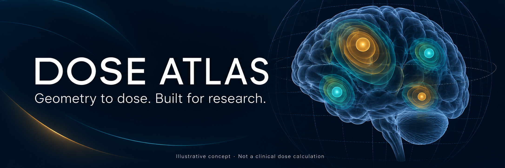
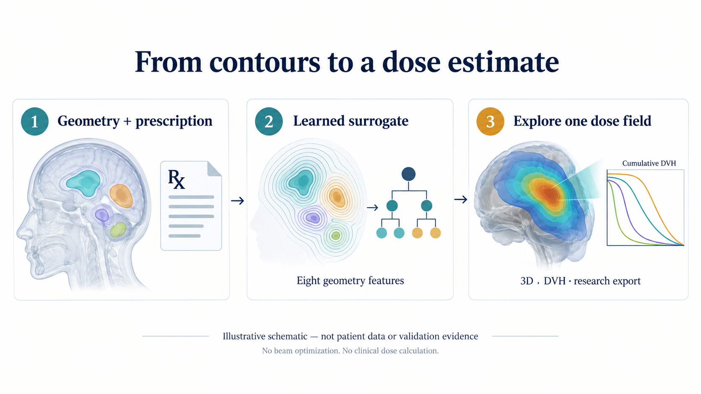

# Dose Atlas

**An interactive, geometry-based dose surrogate for exploratory cranial SRS analysis.**

[Try the hosted demo](https://dose-atlas.kiragroh.cloud/) · [Method](docs/METHOD.md) · [Model setup](docs/MODELS.md) · [Validation](docs/VALIDATION.md) · [Cite](CITATION.cff)

Turn selected target contours and an explicit prescription into an estimated three-dimensional dose field. Explore contours, dose views, per-target DVHs and dosimetric metrics; optionally compare a reference RTDOSE. The same computed field supplies the display, metrics and research export.

> **Research software, not a treatment planning system.** No beam optimization, physical transport calculation, learned OAR sparing, achievable-optimum claim, or clinical approval. Do not use estimated dose for treatment decisions.



*AI-generated conceptual illustrations, not patient anatomy, application screenshots or measured results. The DVH sketch is illustrative; application DVHs are empirical voxel-based curves. CT/anatomical intensities are not model inputs.*

## What is included?

- Local Python/FastAPI application with a browser GUI; German/English and light/dark modes.
- RTSTRUCT inspection, explicit target selection and per-target Rx; optional reference RTDOSE comparison.
- Axial dose/isodose views, interactive target geometry, DVHs, D98/D95/Dmean/D2/V100, domain-limited conformity/gradient/V12 metrics and exploratory ring analysis.
- Research RTDOSE/RTSTRUCT export after trained-model inference; synthetic privacy/geometry tests.
- Near-target HGB, spatial regularization, calibration source code and the separate experimental distal-model module.
- A **weight-free analytic synthetic demo** so a clean checkout can exercise the GUI.

**Not included:** patient DICOMs, original case caches, trained patient-derived weights, credentials, clinical records or the private RN register. Structure-registered longitudinal sums and the RN head-grid integration are documented boundaries, not features of this standalone release. See [scope](docs/METHOD.md#longitudinal-rn-integration).

## Start locally

Python **3.13** recommended. On Windows:

```powershell
git clone https://github.com/Kiragroh/dose-atlas.git
cd dose-atlas
py -3.13 -m venv .venv
.\.venv\Scripts\python -m pip install -r requirements-runtime.txt
.\.venv\Scripts\python -m uvicorn app:app --host 127.0.0.1 --port 18766 --no-access-log
```

On Linux/macOS use `python3.13 -m venv .venv` and `.venv/bin/python` instead. Open **http://127.0.0.1:18766** and choose **Synthetische Demo laden / Load synthetic demo**. Local use does not require a cloud account or GPU. Keep the service bound to loopback.

**A clean clone does not contain a trained model.** Its demo uses an explicitly labelled analytic heuristic on six artificial targets, not the published HGB or a clinical validation case. Uploaded-case prediction fails closed without model weights; it never silently substitutes the analytic demo. For actual model inference install trusted authorized weights or train on your own authorized data: [model guide](docs/MODELS.md). The hosted service has its own model installation; hosted uploads require an approved account.

## Research workflow

1. Load RTSTRUCT and optionally reference PLAN-RTDOSE in physical Gy.
2. Select the actual individual targets. Do not select a union and its constituent targets together.
3. Enter the prescription, check any dose-derived suggestion, and choose the model variant. Only one fraction is supported; the original development range was 18–20 Gy.
4. Inspect dose support, per-target curves and metrics. Missing support is unknown, not zero. V12 is not automatically whole-brain V12.
5. Export a clearly labelled research result. Original DICOM files are not modified.

Browser-side identifier removal is not certified anonymization. Geometry is still sensitive. Use local processing for clinical data unless your institution has explicitly authorized the destination and data transfer. Never attach patient cases to public issues.

## How it works

Eight geometry features describe target distance, size, proximity and multiplicity. A histogram gradient boosting regressor estimates prescription-normalized dose. CT, beams, MLCs and the reference dose are not inference features. Spatial regularization, empirical calibration and distal-dose extension are separate variants with separate evidence.

The original internal development series comprised **10 cases / 82 targets** with patient-wise leave-one-out evaluation. Raw target voxel MAE was **0.842 Gy**; 1-mm regularization changed it to **1.297 Gy**, while case-macro target D98 error changed from **1.877 to 0.422 Gy**. These are development-cohort findings, not external validation or metrics for the weight-free demo. See [validation and limitations](docs/VALIDATION.md).

## Test

```powershell
python -m pip install -r requirements-runtime.txt pytest requests
python -m pytest -q
```

Some integration tests require Node.js; tests requiring private model weights or private fixtures explicitly skip when absent. A passing software suite is not clinical validation.

## Citation and reuse

MIT-licensed source. Use **Cite this repository**, pin the software version and commit, and record the model hash/variant used in your work. The initial release is **v0.1.0**, a research source prerelease; **no DOI has been assigned**. [CITATION.cff](CITATION.cff) uses the project contributor name, not an invented paper author list. A manuscript-ready Methods paragraph and exact variant distinctions are in [METHOD.md](docs/METHOD.md).

The banner and method illustration were generated with GPT Image using no patient inputs. [Prompts and provenance](docs/assets/PROVENANCE.md). This is a community research project, not an institutional or vendor endorsement.
