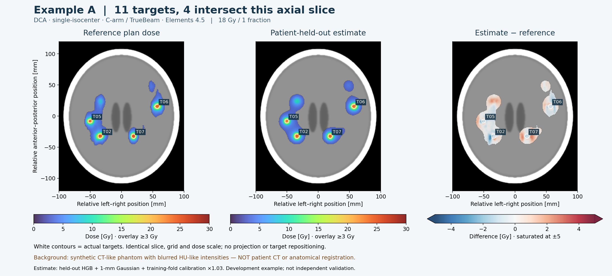
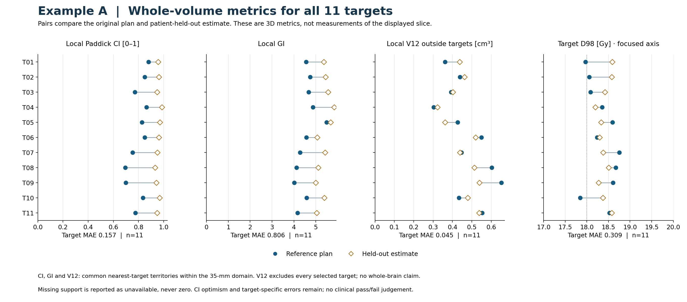
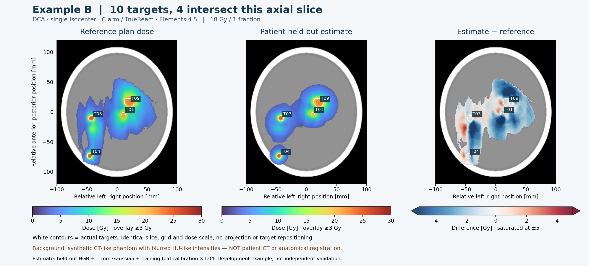
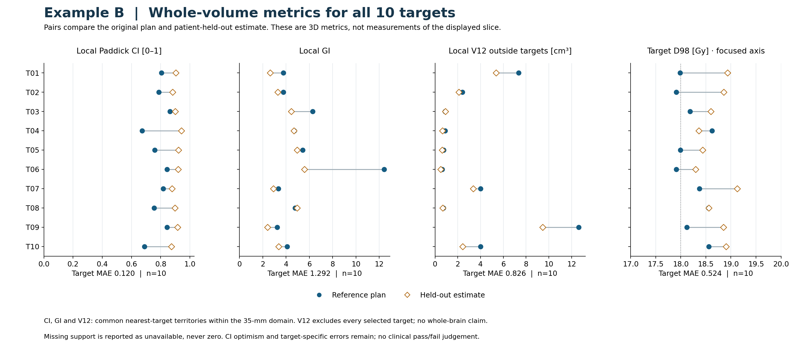

# Real plan / held-out estimate comparisons

These are two geometry-selected development examples, not independent validation or examples chosen for low error. The reference is exported PLAN-RTDOSE resampled to the same 1-mm grid as the model. Predicted dose comes from the cached model trained **without that patient**, followed by 1-mm Gaussian regularization and a scalar selected within that patient's training fold (1.03 in A, 1.04 in B). The distributed deployment model is trained on all ten cases and is **not** used for these illustrations.

## Plan provenance

**DCA, single-isocenter, C-arm / TrueBeam, Brainlab Elements 4.5** is the investigator-provided description. Read-only inspection of all ten RTPLAN files independently found Brainlab / DosePlanning / software **4.5.1.318**, exactly one isocenter per plan, and 154 dynamic beams with rotating gantry control points. Those tags do not distinguish DCA from VMAT or independently establish TrueBeam; see [provenance manifest](../artifacts/MODEL_MANIFEST.json).

## Background and selection

The CT-like background is a **fixed mathematical head phantom with blurred HU-like intensities**. No source CT, patient surface or facial anatomy was used. It is illustrative, not an anatomical registration. Dose and target positions are unchanged apart from translating the displayed coordinate origin. Blurring a real CT would not by itself establish anonymization.

For every case, select the axial slice with most distinct intersecting targets, then largest target cross-sectional area, then lowest slice index. Rank cases by visible target count, total target count and slice target area. The top two are shown. No dose or prediction error enters selection. Maximum observed multiplicity was four intersecting targets; no projection is used to manufacture a denser slice.

## Example A — 11 targets, 18 Gy in one fraction





[Exact target metrics CSV](examples/example-a-metrics.csv) · [Machine-readable provenance and metrics](examples/example-a.json) · [Slice SVG](examples/example-a-slice.svg) · [Metric SVG](examples/example-a-metrics.svg)

## Example B — 10 targets, 18 Gy in one fraction





[Exact target metrics CSV](examples/example-b-metrics.csv) · [Machine-readable provenance and metrics](examples/example-b.json) · [Slice SVG](examples/example-b-slice.svg) · [Metric SVG](examples/example-b-metrics.svg)

## Metric definitions

Every displayed metric uses the full **3D** volume, not the chosen 2D slice. Prescription is 18 Gy in both examples. A common dose-independent nearest-target partition assigns each supported voxel within 35 mm of selected targets to one target. Ties use SciPy EDT's deterministic assignment. All 21 targets have complete support within their declared territories; this does not establish whole-brain dose coverage.

- **Local Paddick CI** = (target volume covered by Rx)² / (target volume × Rx-isodose volume within its territory). This is the 0–1 conformity index, **not** its inverse.
- **Local GI** = volume ≥0.5 Rx / volume ≥Rx in that same territory.
- **Local V12** = territory volume ≥12 Gy outside **all** selected targets, in cm³. It is a partitioned domain metric, not whole-brain V12, isolated-plan V12 or an RN risk probability.
- **D98** = the second percentile of dose in the entire target, in Gy, computed from all target voxels.

| Mean absolute target error | Example A (11 targets) | Example B (10 targets) |
|---|---:|---:|
| Local Paddick CI | 0.157 | 0.120 |
| Local GI | 0.806 | 1.292 |
| Local V12 [cm³] | 0.045 | 0.826 |
| D98 [Gy] | 0.309 | 0.524 |

These are descriptive errors within two selected cases, not cohort performance estimates. Mean predicted CI exceeds the reference in both examples (A: 0.957 vs 0.800; B: 0.903 vs 0.783). That is **surrogate conformity optimism**, not evidence that an achievable better plan exists. Example B also shows substantial spatial and local dose-volume differences. No clinical pass/fail thresholds are applied. See [cohort-level validation](VALIDATION.md) for the broader evidence and limitations.

## Reproduce on authorized local caches

```shell
python scripts/render_plan_comparison.py --source-root /authorized/dose-atlas --output docs/examples --count 2
```

Requires the original private `C??.npz`, `C??.json` and `C??_heldout.npz` caches plus the matching calibration card. These are not distributed. The script performs no fitting and does not modify inputs. Published CSV/JSON and editable SVG/PNG outputs can be reused without private caches. Private-input content hashes retain a provenance link without exporting identifiers or absolute paths. The background generator accepts only plotting extent and dimensions, never source CT.
